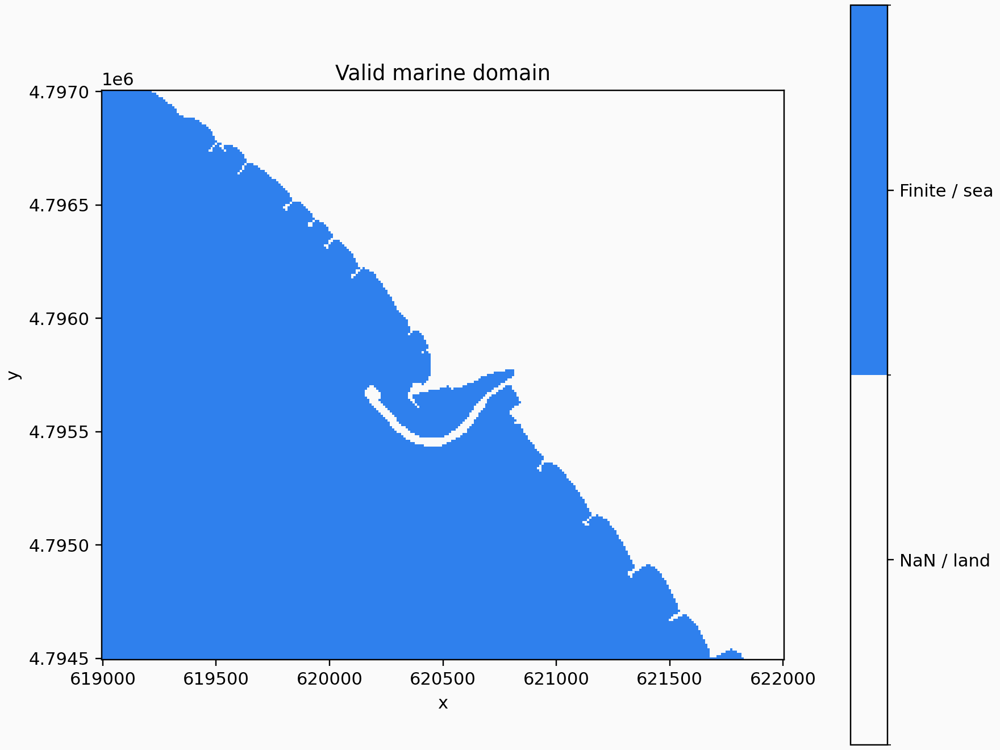
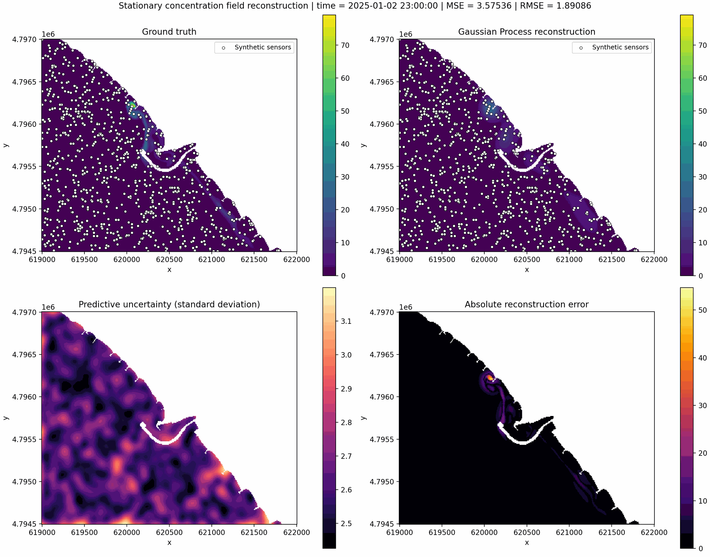
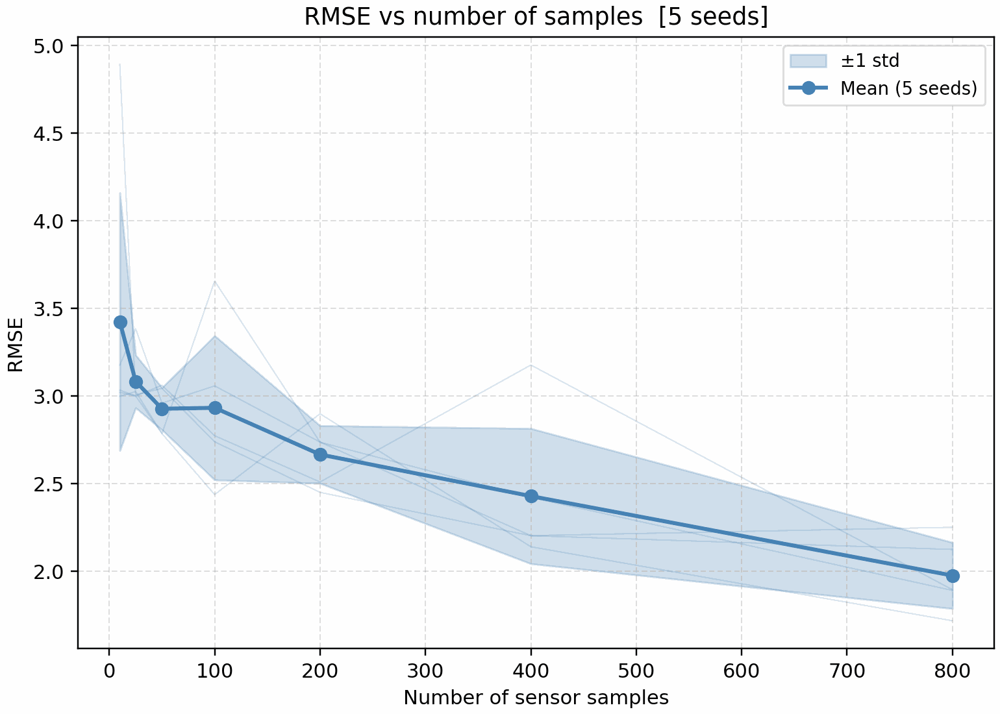
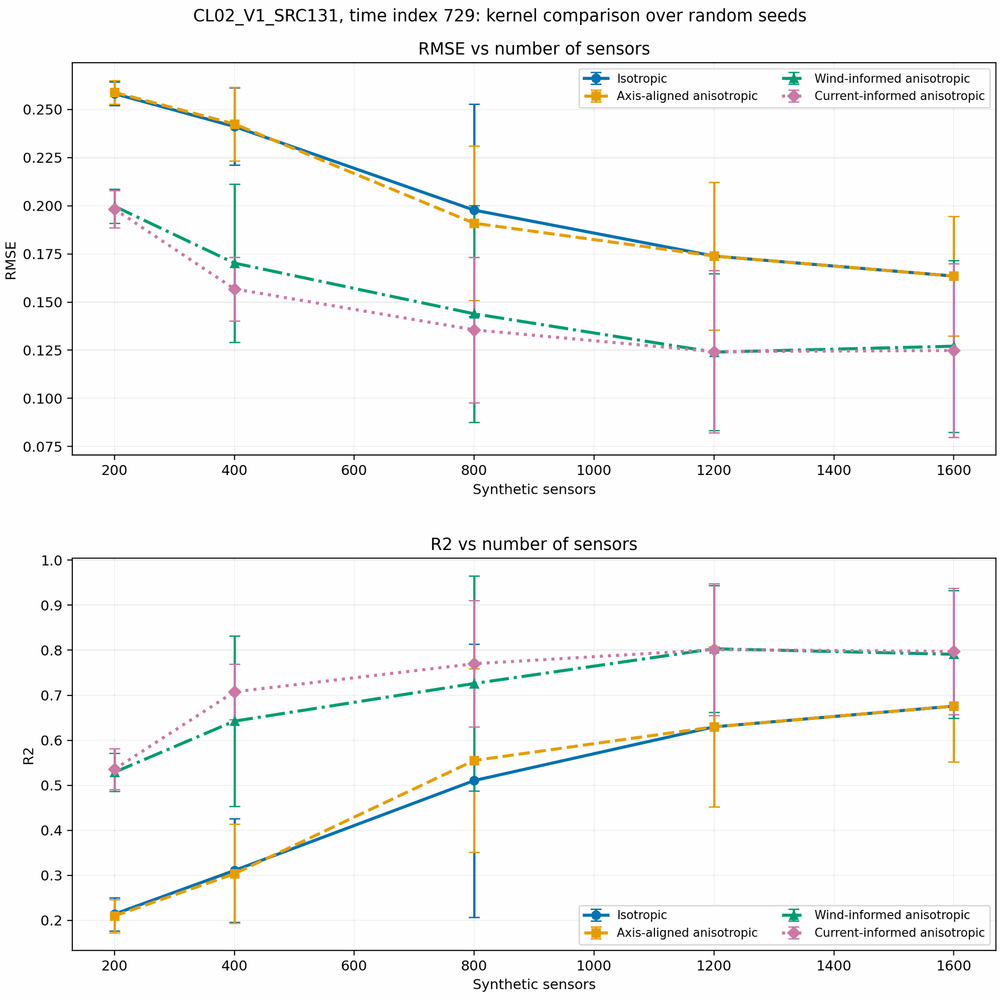

# HYDRAS Thesis Project

**Reconstruction and localisation of marine pollutant sources using Gaussian Processes and underwater robots**

This repository contains the Python code, the working report and the thesis sources for a Master's
project on probabilistic reconstruction of marine pollutant concentration fields. The long-term goal
is to estimate the spatial distribution of a pollutant from sparse measurements collected by
underwater robots, and to use the reconstructed field to support informative exploration and source
localisation.


---

## Table of Contents

- [Project Goal](#project-goal)
- [How It Works](#how-it-works)
- [Thesis Roadmap](#thesis-roadmap)
- [Current Status](#current-status)
- [Key Result](#key-result)
- [Results Snapshot](#results-snapshot)
- [Repository Structure](#repository-structure)
- [Installation](#installation)
- [Data](#data)
- [Usage](#usage)
- [Command-Line Arguments](#command-line-arguments)
- [Outputs](#outputs)

---

## Project Goal

In realistic marine monitoring scenarios, pollutant concentration is not available continuously over
the full domain. It can only be observed at a limited number of positions, or along trajectories
followed by autonomous underwater robots.

This project studies how **Gaussian Processes (GPs)** can be used to:

1. reconstruct a pollutant concentration field from sparse measurements;
2. quantify predictive uncertainty over the marine domain;
3. evaluate how many measurements are needed for reliable reconstruction;
4. encode physical knowledge about pollutant transport into the covariance function;
5. guide robot motion and localise the pollutant source.

Gaussian Processes are useful here because they return both a mean prediction and a predictive
uncertainty. That makes them suitable not only for interpolation, but also for informative path
planning, since the predictive variance depends only on *where* measurements were taken and not on
*what* they returned — so a candidate measurement can be scored before it is made.

---

## How It Works

The baseline pipeline turns one snapshot of a simulated field into a probabilistic reconstruction:

```mermaid
flowchart LR
    A["NetCDF dataset<br/>Concentration - component 1"] --> B["Select time snapshot"]
    B --> C["Valid marine mask<br/>np.isfinite(field)"]
    C --> D["Sample N synthetic sensors<br/>without replacement"]
    D --> E["Standardise coordinates<br/>StandardScaler"]
    E --> F["Fit GP<br/>ConstantKernel x RBF + WhiteKernel"]
    F --> G["Predict over all valid cells<br/>in batches"]
    G --> H["Clip negatives<br/>optional"]
    H --> I["Mean map, uncertainty map,<br/>RMSE / MAE / R2"]
```



The physically informed variant changes **only the coordinate system in which the covariance is
defined**. The field, the grid and the output maps are untouched:

```mermaid
flowchart LR
    W["Wind file"] --> M["Mean transport direction<br/>over a time window"]
    U["Current file<br/>U/V NetCDF"] --> M
    M --> T["Rotation angle theta"]
    T --> R["Rotate sensor and prediction<br/>coordinates about the domain centre"]
    R --> K["Fit the anisotropic RBF<br/>in the rotated frame"]
    K --> P["Predict, then report the maps<br/>in the original coordinates"]


---

## Thesis Roadmap

```mermaid
flowchart TD
    P1["Phase 1 - Stationary reconstruction<br/>from sparse point samples"]
    P1B["Phase 1b - Physically informed covariance<br/>oriented by wind or current"]
    P2["Phase 2 - Measurements collected<br/>along robot trajectories"]
    P3["Phase 3 - Informative exploration<br/>driven by GP uncertainty"]
    P4["Phase 4 - Pollutant source localisation"]

    P1 --> P1B --> P2 --> P3 --> P4

    classDef phase fill:#86cce3,stroke:#4a8ac4,stroke-width:1px,color:#000000
    class P1,P1B,P2,P3,P4 phase
```


The package structure is intentionally modular so that trajectory sampling, informative planning and
source localisation can be added without rewriting the Phase 1 baseline.

---

## Current Status

Implemented:

- NetCDF dataset loading and layout validation with `xarray`;
- extraction of a single time snapshot and valid-domain detection from finite values;
- synthetic sensor sampling on valid marine cells, without replacement, with optional noise;
- GP fitting with isotropic or anisotropic RBF kernels, plus `ConstantKernel` and `WhiteKernel`;
- **coordinate rotation informed by an external forcing**, from a wind time series or from a
  current U/V NetCDF file, with a configurable averaging window;
- full-field reconstruction on the original grid, with batched prediction;
- predictive uncertainty maps and error metrics: MSE, RMSE, MAE, R2;
- single-seed and multi-seed sample-size studies;
- **multi-seed comparison of four covariance structures** — isotropic, axis-aligned anisotropic,
  wind-informed and current-informed — on identical shared samples;
- positivity diagnostics before clipping, and an optional `log1p` target transform;
- length-scale bound diagnostics, reporting how often an optimised length scale reaches its bound;
- NetCDF inspection utilities.

---

## Key Result

Anisotropy alone buys nothing; anisotropy **with the right orientation** buys a great deal.

Averaged over five random seeds on the `CL02_V1_SRC131` scenario at time index 729, with identical
samples shared by all four models and a length-scale lower bound of 0.075:

| Sensors | Isotropic | Axis-aligned | Wind-informed | Current-informed |
|---:|---:|---:|---:|---:|
| 200 | 0.2582 | 0.2589 | 0.1998 | **0.1983** |
| 400 | 0.2411 | 0.2425 | 0.1702 | **0.1568** |
| 800 | 0.1977 | 0.1909 | 0.1439 | **0.1356** |
| 1200 | 0.1739 | 0.1739 | **0.1240** | 0.1243 |
| 1600 | 0.1635 | 0.1635 | 0.1271 | **0.1248** |

Mean RMSE on the valid marine cells; lower is better. The axis-aligned anisotropic model is
indistinguishable from the isotropic one, because an ellipse constrained to the grid axes cannot
follow a plume that runs north-west to south-east. The two physically informed models — whose
transport directions are estimated independently, from wind and from current, and agree to within
about two degrees — reduce the error by roughly a quarter.

---

## Results Snapshot

A small number of curated figures. Diagnostic panels are discussed in the report, not here.

### Valid Marine Domain



The valid domain is extracted from finite concentration values. Sampling, reconstruction and metric
computation are all restricted to these cells.

### Stationary Reconstruction Example



Reconstruction at time index `2820` with 800 synthetic sensors. The four panels show the ground
truth, the GP mean, the predictive standard deviation and the absolute error. This run reaches
`RMSE = 1.89` and `R2 = 0.60` on valid marine cells.

### Multi-Seed Sample-Size Study



The mean trend improves with the number of samples, while the spread across seeds shows that
*where* the sensors fall matters as much as how many there are — especially for localised plumes.

### Kernel Comparison



The four covariance structures on shared samples. The isotropic and axis-aligned curves overlap; the
two physically informed curves separate clearly from them.

---

## Repository Structure

```text
main.py                     Entry point: parses arguments and runs the workflow
pollutant_gp/
  cli.py                    Command-line interface
  data.py                   NetCDF loading, validation and grid preparation
  inspection.py             NetCDF inspection utilities
  model.py                  Kernel construction, GP fitting, batched prediction
  reconstruction.py         Full-field reconstruction and error metrics
  sampling.py               Synthetic sensor sampling
  spatial.py                Coordinate rotation used by the physically informed models
  wind.py                   Wind time series parsing and transport direction
  current.py                Current U/V fields and mean transport direction
  types.py                  Shared dataclasses
  visualization.py          Plot generation
  workflow.py               Pipeline orchestration and experimental studies

requirements.txt
README.md
```

Local environments, Python caches, run-time outputs, LaTeX build artefacts and NetCDF datasets are
not tracked by Git.

---

## Installation

```bash
pip install -r requirements.txt
```

Recommended Python version: 3.10 or newer. Dependencies: `numpy`, `scipy`, `xarray`, `netCDF4`,
`scikit-learn`, `matplotlib`, `pillow`.

---

## Data

The project uses NetCDF simulation files produced with the MIKE 21 Flow Model FM for the waters
around the port of Cecina. Concentration files use:

```text
variable:    Concentration - component 1
dimensions:  time, y, x
coordinates: time, y, x
```

Velocity files carry `u_velocity` and `v_velocity` on the same grid and are used by the
current-informed model. Land and excluded cells are stored as `NaN`, so the navigable domain is
recovered from the data themselves:

```python
valid_mask = np.isfinite(field)
```

Large NetCDF files are ignored by Git. Keep them locally and pass their path with `--nc-file`.

---

## Usage

All commands are run from the repository root.

### Inspect the data

```bash
python main.py --print-dataset --time-index 705
python main.py --inspect-netcdf --netcdf-dir .
```

### Standard reconstruction

```bash
python main.py --nc-file CL02_V1_SRC131_Conc_10mGrid.nc --time-index 729 --n-samples 200
```

### Physically informed reconstruction

Rotate the covariance along the wind-derived transport direction:

```bash
python main.py --nc-file CL02_V1_SRC131_Conc_10mGrid.nc --time-index 729 \
  --n-samples 800 --physically-informed
```

Or along the mean sea current, averaged over the twelve hours preceding the snapshot:

```bash
python main.py --nc-file CL02_V1_SRC131_Conc_10mGrid.nc --time-index 729 \
  --n-samples 800 --current-informed --current-average-hours 12
```

### Compare the four covariance structures

All models are evaluated on identical samples for every `(seed, N)` pair, so differences are
attributable to the model and not to the data:

```bash
python main.py --nc-file CL02_V1_SRC131_Conc_10mGrid.nc --time-index 729 \
  --kernel-comparison-study \
  --sample-size-study-counts 200 400 800 1200 1600 \
  --sample-size-study-seeds 7 42 123 256 512 \
  --length-scale-lower-bound 0.075
```

### Sample-size studies

```bash
python main.py --time-index 2820 --sample-size-study-multiseed \
  --sample-size-study-counts 10 25 50 100 200 400 800 \
  --sample-size-study-seeds 7 42 123 256 512
```

### Positivity of the predictions

```bash
python main.py --time-index 729 --target-transform log1p
python main.py --time-index 729 --allow-negative-predictions
```

---

## Command-Line Arguments

| Argument | Default | Description |
|---|---:|---|
| `--nc-file` | `CMEMS_S1_01_conc_grid_10m.nc` | NetCDF file used for reconstruction |
| `--time-index` | auto | Time index to reconstruct or inspect |
| `--n-samples` | `200` | Number of synthetic sensors |
| `--noise-std` | `0.0` | Standard deviation of the simulated sensor noise |
| `--random-seed` | `7` | Seed for the main reconstruction |
| `--kernel-mode` | `anisotropic` | One length scale per axis, or a single shared one |
| `--physically-informed` | off | Rotate coordinates along a physical transport direction |
| `--physics-source` | `wind` | Forcing used for the rotation: `wind` or `current` |
| `--current-informed` | off | Shortcut for `--physically-informed --physics-source current` |
| `--wind-file` | `CI_WIND_faseII_V1.txt` | Wind forcing time series |
| `--wind-average-hours` | `12.0` | Averaging window preceding the snapshot |
| `--current-file` | `CL02_V1_SRC000_U_V_10mGrid.nc` | Current U/V dataset |
| `--current-average-hours` | `12.0` | Averaging window for the mean current |
| `--length-scale-lower-bound` | `0.05` | Lower bound in standardised coordinates; acts as regularisation |
| `--length-scale-upper-bound` | `100.0` | Upper bound in standardised coordinates |
| `--target-transform` | `none` | `none` or `log1p` |
| `--n-restarts` | `0` | Additional optimiser restarts |
| `--clip-negative` | on | Clip negative mean predictions to zero |
| `--allow-negative-predictions` | off | Keep negative predictions instead of clipping |
| `--prediction-batch-size` | `20000` | Grid points predicted per batch |
| `--sample-size-study` | off | Single-seed sample-size study |
| `--sample-size-study-multiseed` | off | Multi-seed sample-size study |
| `--kernel-comparison-study` | off | Multi-seed comparison of the four covariance structures |
| `--sample-size-study-counts` | `10 25 50 100 200 400 800` | Sample counts used by the studies |
| `--sample-size-study-seeds` | `7 42 123 256 512` | Seeds used by the multi-seed studies |
| `--output-dir` | `outputs` | Directory where figures are saved |
| `--figure-name` | auto | Custom name for the main figure |
| `--show` | off | Show figures interactively as well as saving them |

For the complete list:

```bash
python main.py --help
```

---


## Outputs


A reconstruction produces a combined overview plus the same four panels saved separately, so that a
single map can be reused in a report or a slide without cropping:

| File | Content |
|---|---|
| `<base>.png` | four-panel overview |
| `<base>_ground_truth.png` | simulated concentration field |
| `<base>_gp_reconstruction.png` | GP posterior mean |
| `<base>_predictive_uncertainty.png` | predictive standard deviation |
| `<base>_absolute_error.png` | absolute error against the ground truth |

`<base>` is built from dataset name, time index, sample count and timestamp, and can be replaced
with `--figure-name`.

The studies write their own curves. The sample-size studies plot RMSE, MAE and R2 against the number
of sensors, with one faint line per seed and the mean in bold in the multi-seed version;
`--kernel-comparison-study` plots the same metrics with one curve per covariance structure.

Results are saved locally in the `outputs/` directory.


